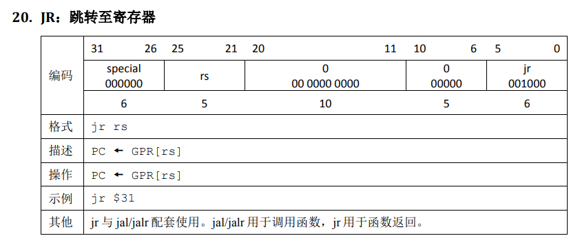
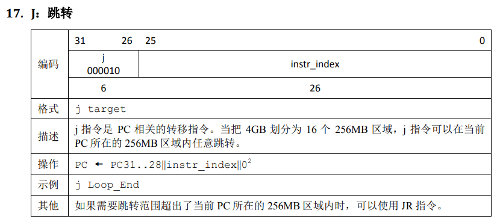

1、我们使用提前分支判断的方法尽早产生结果来减少因不确定而带来的开销，但实际上这种方法并非总能提高效率，请从流水线冒险的角度思考其原因并给出一个指令序列的例子。

暂停可能变多。如lw nop beq 如果beq和lw用了同样的寄存器，则会暂停；如果beq结果在E级产生，则不需要暂停。

2、因为延迟槽的存在，对于 jal 等需要将指令地址写入寄存器的指令，要写回 PC + 8，请思考为什么这样设计？

因为pc+4（即延迟槽）中的指令必然会执行，如果写回pc+4，则会导致重复执行。

3、我们要求大家所有转发数据都来源于流水寄存器而不能是功能部件（如 DM 、 ALU ），请思考为什么？

一个时钟周期内需要完成两件任务，必然导致时钟周期拉长，频率降低。

4、我们为什么要使用 GPR 内部转发？该如何实现？

为了保持W级写入该寄存器的值和D级读出的值相同，可以通过在grf模块中加一个mux解决。

5、我们转发时数据的需求者和供给者可能来源于哪些位置？共有哪些转发数据通路？

需求者：D E M W

供给者：E-M流水寄存器 M-W流水寄存器

通路：在每个数据供给者处将写入寄存器的值转发回来；在每个需求者处加mux，选择转发回来的数据。

6、在课上测试时，我们需要你现场实现新的指令，对于这些新的指令，你可能需要在原有的数据通路上做哪些扩展或修改？提示：你可以对指令进行分类，思考每一类指令可能修改或扩展哪些位置。

改变ctrl模块，再改对应的功能模块（计算类alu 访存dm 跳转npc）

7、确定你的译码方式，简要描述你的译码器架构，并思考该架构的优势以及不足。

集中式译码。（三译码器）

优势：简单、只需要修改一个地方，instr不需要流水。

不足：所有控制信号均需要流水，D级时间变长。

1、[P5 选做] 在冒险的解决中，我们引入了 AT 法，如果你有其他的解决方案，请简述你的思路，并给出一段指令序列，简单说明你是如何做到尽力转发的。

2、[P5 选做] 请详细描述你的测试方案及测试数据构造策略。

3、[P5、P6 选做] 请评估我们给出的覆盖率分析模型的合理性，如有更好的方案，可一并提出。

# 设计草稿

## 指令说明

**和自己的变量名称小约定 **
功能模块内部信号：部件名全部小写+功能名称第一个字母大写+\_阶段字母
参与传递的信号：前一阶段\_+名称+\_后续阶段
阶段输出：阶段\_+名称
指令变量全部小写

## 通路、阻塞分析
### 阻塞分析

|指令|Tuse1|Tuse2|Tnew_E|Tnew_M|Tnew_W|
|:-:|:-:|:-:|:-:|:-:|:-:|
|add|1|1|1|0|0|
|sub|1|1|1|0|0|
|ori|1||1|0|0|
|lw|1||2|1|0|
|sw|1|2|0|0|0|
|beq|0|0|0|0|0|
|lui|1||1|0|0|
|jal|||PC8|0|0|
|jr|0||0|0|0|
|nop|||0|0|0|

## 模块设计

### npc
|端口|方向|位宽|功能|
|:-:|:-:|:-:|:-:|
|pc|I|[31:0]|当前指令地址|
|  index  |  I   | [25:0] |         地址偏移量          |
| npcOp |  I   | [2:0]  |取指方式|
| reset | I |  |复位|
| cmpOut | I |  |cmp的结果, 用于判断是否跳转|
| ra | I | [31:0] |return address register|
|  npc  |  O   | [31:0] |  下一条指令  |

### im
|端口|方向|位宽|功能|
|:-:|:-:|:-:|:-:|
|pc|I|[31:0]|当前指令地址|
|instr|O|[31:0]|当前指令|

### ext

|端口|方向|位宽|功能|
|:-:|:-:|:-:|:-:|
|extWay|I||0: zero 1: sign|
|offset|I|[15:0]||
|offset32|O|[31:0]|拓展后的立即数|

### cmp

|端口|方向|位宽|功能|
|:-:|:-:|:-:|:-:|
|cmpA|I|[31:0]|输入A|
|cmpB|I|[31:0]|输入B|
|cmpOp|I|[2:0]|选择比较方式|
|cmpOut|O||是否符合设置的比较条件|

cmpOp:000-equal

### dm
|端口|方向|位宽|功能|
|:-:|:-:|:-:|:-:|
|clk|I|||
|reset|I|||
|memW|I||写入使能|
|memRa|I|[31:0]|写入 地址|
|memWd|I|[31:0]|写入数据|
|pc|I|[31:0]||
|memOut|O|[31:0]|读出的数据|

### grf
|端口|方向|位宽|功能|
|:-:|:-:|:-:|:-:|
|clk|I|||
|reset|I|||
|regRa1|I|[4:0]|读地址1|
|regRa2|I|[4:0]|读地址2|
|regW|I||写入使能|
|regWa|I|[4:0]|写入地址|
|regWd|I|[31:0]|写入数据|
|pc|I|[31:0]||
|regOut1|O|[31:0]|读出数据1|
|regOut2|O|[31:0]|读出数据2|

### alu

|端口|方向|位宽|功能|
|:-:|:-:|:-:|:-:|
|aluA|I|[31:0]||
|aluB|I|[31:0]||
|aluOp|I|[2:0]||
| shamt  |  I   | [4:0]  ||
| aluOut |  O   | [31:0] ||

## 控制模块

### controller
|端口|方向|位宽|功能|
|:-:|:-:|:-:|:-:|
|pc|I|[31:0]||
|instr|I|[31:0]||
|isBranch|I||是否跳转|
|isStall|I||是否阻塞|
|code|O|[5:0]||
|func|O|[5:0]||
|rs|O|[4:0]||
|rt|O|[4:0]||
|rd|O|[4:0]||
|offset|O|[15:0]|lw与beq等|
|index|O|[25:0]|j指令|
|regW|O||寄存器写入使能|
|regWsrc|O|[1:0]|寄存器写入的数据来源选择|
|regWdst|O|[4:0]|寄存器写入的目标位置|
|memToreg|O||从dm读入到grf|
|   memW   |  O   |        |        dm写入使能        |
|  aluOp   |  O   | [2:0]  |       alu功能选择        |
|  extWay  |  O   |        |       ext方式选择        |
|  npcOp   |  O   | [2:0]  |         npc选择          |
| aluSrc2  |O||alu输入B选择|

### stallctrl

|端口|方向|位宽|功能|
|:-:|:-:|:-:|:-:|
|D_rs|I|[4:0]||
|D_rt|I|[4:0]||
|E_regWd|I|[4:0]||
|M_regWd|I|[4:0]||
|E_regW|I||E级指令是否写入|
|M_regW|I||W级指令是否写入|
|D_Tuse1|I|[1:0]|D级use1|
|D_Tuse2|I|[1:0]|D级use2|
|E_Tnew|I|[1:0]|E级new|
|M_Tnew|I|[1:0]|W级new|
|isStall|O||是否需要阻塞|

### fowardctrl

|端口|方向|位宽|功能|
|:-:|:-:|:-:|:-:|
|   D_rs    |  I   | [4:0]  |      |
|   D_rt    |  I   | [4:0]  |      |
|   E_rs    |  I   | [4:0]  |      |
|   E_rt    |  I   | [4:0]  |      |
|   M_rs    |  I   | [4:0]  |      |
|   M_rt    |  I   | [4:0]  |      |
| E_regW_M  |  I   |        |      |
| E_regWa_M |  I   | [4:0]  |      |
| M_regW_W  |  I   |        |      |
| M_regWa_W |  I   | [4:0]  |      |
| E_regWd_M |  I   | [31:0] |      |
| M_regWd_W |  I   | [31:0] |      |
|  D_pc8_E  |  I   | [31:0] |      |
|  E_pc8_M  |  I   | [31:0] |      |
|M_pc8_W|I|[31:0]||
|regFor1_D|O|[31:0]||
|regFor2_D|O|[31:0]||
|regFor1_E|O|[31:0]||
|regFor2_E|O|[31:0]||
|regFor1_M|O|[31:0]||
|regFor2_M|O|[31:0]||
|pc8_D|O|[31:0]||
|pc8_E|O|[31:0]||
|pc8_M|O|[31:0]||

### pipereg

|端口|方向|位宽|功能|
|:-:|:-:|:-:|:-:|
|clk|I|||
|reset|I|||
|isStall|I|||
|in|I|[width-1:0]||
|out|O|[width-1:0]||

## 数据通路

## 控制信号

|指令|regW|regWsrc|regWdst|memToreg|memW|aluOp|extWay|npcOp|aluSrc1|aluSrc2|
|:-:|:-:|:-:|:-:|:-:|:-:|:-:|:-:|:-:|:-:|:-:|
|add|1|00|00|0|0|000|0|000|0|0|
|sub|1|00|00|0|0|001|0|000|0|0|
|ori|1|00|01|0|0|011|0|000|0|1|
|lw|1|x|01|1|0|000|1|000|0|1|
|sw|0|x|x|0|1|000|1|000|0|1|
| beq  |  0   |    x    |    x    |    0     |  0   |  000  |   1    |  001  |    0    |0|
| lui  |  1   |   00   |   00   |    0     |  0   |  101  |   0    |000|0|0|
|  j   |  0   |    x    |    x    |    0     |  0   |  100  |   0    |  011  |    0    |    0    |
| jal  |  1   |   10    |   10    |    0     |  0   |  100  |   0    |011|0|0|
|  jr  |  0   |    x    |    x    |    0     |  0   |  100  |   0    |010|0||
|nop|0|x|x|0|0|100|0|000|0|0|

regW: 1-write || regWsrc:00-alu 10-PC+4

regDst: 00-op[15:11]rd 01-op[20:16]rt 10-$31 //修正为为目标位置

memW:1-write to DM memToreg:1-memOut 0-regWsrc

npcOp:000-pc4 001-offset||0+pc4 010-register 011-PC[31:28],index,00

aluOp: 000-add 001-sub 010-mul 011-or 100-null 101-lui

cmpOp:000-isEqual

extWay: 0-zero 1-sign

aluSrc2:0-regOut2 1-ext

## 转发与阻塞

|指令|rs_use|T_use1|rt_use|T_use2|T_new|
|:-:|:-:|:-:|:-:|:-:|:-:|
|add|1|1|1|1|2|
|sub|1|1|1|1|2|
|ori|1|1|1|3|2|
|lw|1|1|1|3|3|
|sw|1|1|1|2|0|
|beq|1|0|1|0|0|
|lui|0|x|1|1|2|
|j|0|x|0|x|0|
|jal|0|x|0|x|0|
|jr|1|0|0|x|0|
|nop|0|x|0|x|0|
